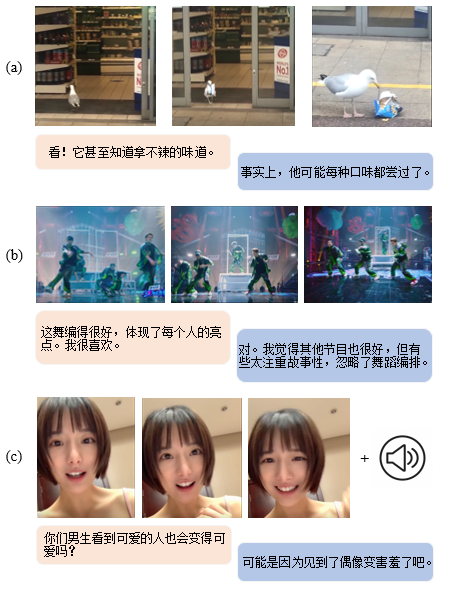

# 2023CCL-VideoMMD

# 基于视频的多模态闲聊 

# 最新消息

| 时间 | 消息 |
| --- | --- |
| 4月10日 | [开放报名]([https://docs.qq.com/form/page/DQkxvUXJLWmVQbGhO](https://docs.qq.com/form/page/DSW9sdXRYdExGWmJv)) |
|  |  |

**组织者及联系方式：**

l 宋睿华，中国人民大学

l 傅建龙，微软亚洲研究院

l 刘蓓，微软亚洲研究院

l 俞舟，哥伦比亚大学

l Mingyang Zhou，哥伦比亚大学

l 罗杰波，罗彻斯特大学

 

**负责人及联系方式**

l 林宏鹏（hopelin@ruc.edu.cn），中国人民大学

 

**联系人及联系方式**

l 林宏鹏（hopelin@ruc.edu.cn），中国人民大学

 

**1.**  **任务内容**

随着多模态的研究迅速发展，许多多模态的技术和设想已经被证明对各种任务有很大帮助。将多模态信息引入对话领域也引起了广泛的兴趣[[1\]](https://arxiv.org/pdf/2105.13073.pdf) [[3\]](https://arxiv.org/pdf/1811.00945.pdf)。收集现实世界的多模态对话数据并不容易，现有的工作主要专注于通过众包来构建基于图片的对话数据[[2\]](https://arxiv.org/pdf/1701.08251.pdf)或者从影视作品中获取角色在特定的故事情节中的对话[[6\]](https://arxiv.org/pdf/2012.15015.pdf) [[7\]](https://arxiv.org/pdf/2205.10237.pdf) [[9\]](https://arxiv.org/pdf/2109.12761.pdf)。还有一些研究人员从社交媒体上获取静态图片和评论作为对话数据[[4\]](https://arxiv.org/pdf/2108.07154.pdf) [[5\]](https://arxiv.org/pdf/2211.05719.pdf)。我们从社交平台上获取视频和相应的用户评论-回复作为多模态对话的新数据来源，包含更多的多模态信息，数据内容更符合人类的日常对话，并且数据规模容易扩展。我们提出了一个具有挑战性的任务，来评估先进的多模态对话模型和方法。

 

**任务描述：** 基于视频的多模态闲聊任务旨在根据视频片段和对话上下文的信息对对话历史生成回复。为了推动将多模态信息引入人机对话的研究，我们构建了基于视频的对话数据集TikTalk，将社交平台的视频和对应的用户评论-回复处理为基于视频的闲聊对话语料用于本次任务。模型需要将视频和对话上下文作为输入，并生成相应多模态场景下的回复。与纯文本对话任务相比，需要考虑额外的多模态信息的处理，以及研究不同模态的信息之间的如何更好地交互和融合，以产生合理的、令人满意的回复。

 

**2.**  **评测数据**

在本次评测中，我们提供了TikTalk数据集，它是一个多模态的中文对话数据集，包含了38K个视频以及对应的367K段对话。我们从抖音这一视频社交平台上收集视频来构建TikTalk数据集，每个样本包含一段博主上传的短视频及对应的一些元信息，视频下的评论-回复链组成的对话在内容上接近于人们日常生活中的闲聊。抖音用户可以在给视频和评论点赞，并与朋友分享。点赞数高的视频证明它的用户评分高，这可以帮助我们过滤掉低质量的数据。类似地，获得更多赞的评论会被标记为在评论区排名较高的热门评论，并会得到更多的回复。这些机制帮助我们在抓取数据时方便地过滤掉低质量的视频和评论。在清洗过程中，我们首先从收集的视频中获取点赞量高、评论层次多的视频，并将树形评论数据分割成会话语料库。然后，我们使用正则表达式过滤掉句子中无用的内容，比如“@某人”和重复的词语，以及一些不道德的言论。此外，评论通常伴随着表情符号，可以表明用户的情绪。我们从对话中提取它们作为附加信息。考虑到对话的多样性，在验证集和测试集中，我们选取了具有5条真实回复的对话数据当作正样本。TikTalk的数据示例如图1所示，在进行对话时，对话双方不止要考虑文本上下文，还需要参考视频中的多模态信息，比如图像和音频等。更多关于TikTalk数据集的细节可以在[Github页面](https://github.com/RUC-AIMind/TikTalk)和[论文](https://arxiv.org/abs/2301.05880)中找到。

Examples of dialogues from TikTalk dataset.

图1：TikTalk数据集实例。(a) 一只海鸥从商店偷出食物吃掉。(b) 一场舞蹈表演。(c) 一个博主在谈论她的奇怪经历。

**3.**  **评价标准**

我们考虑使用基于检索的指标和基于参考的指标来评测模型的性能。对于以参考为基准的评价指标，我们使用了自动指标和人类评测。

 

l **基于检索的指标**，包括了Recall@K，MeanR。我们使用了5个真实的回复和95个随机挑选的负样例组成候选集，通过计算模型生成候选集中回复的概率进行排序然后计算上述指标。

 

l **基于参考的指标**，包括了BLEU，Rouge-l，Meteor和Cider。我们使用5个真实回复作为每一段对话的参考，在计算指标时取平均值，我们使用公开的NLG评估代码计算这些指标[[8\]](https://github.com/Maluuba/nlg-eval)。此外，为了衡量生成的对话的多样性，我们还采用Distinct指标计算模型生成回复的多样性。

 

l **人类评价。**此外，我们会采用人类评价来衡量生成的对话回复质量。我们使用Sensibleness and Specificity Average（SSA）作为人类评价标准。它涵盖了对话中的人类特征，比如常识、逻辑连贯性、一致性和聊天机器人的其他关键方面。Sensibleness要求注释者在视频和对话上下文基础上判断回复是否合理，Specificity要求注释者判断回复是否与上下文有关。

**4.**  **评测赛程**

l 开放报名：2023.4.10

l 公布训练集和验证集以及评测方法：2023.4.15

l 报名截止：2023.5.1

l 公布测试集：2023.6.1

l 参赛队提交在测试集上生成的结果：2023.6.4

l 组织者返回评测结果：2023.6.15

l 参赛队提交基于视频的多模态对话评测任务技术报告用于审稿：2023.6.25

l 参赛队提交最终版本技术报告：2023.7.10

l CCL 2023评测研讨会，线上公布最终排名，评测结束：2023.8.3-2023.8.5 

 

**5.**  **提交方式**

请仔细阅读[TikTalk数据集申请表](https://github.com/RUC-AIMind/TikTalk/blob/main/Application%20Form.pdf)中的使用规范，然后点击[报名链接](https://docs.qq.com/form/page/DSW9sdXRYdExGWmJv)填写报名表进行报名，我们会发送邮件确认您已经参赛。

 

**6.**  **技术报告**

技术报告可由中文或英文撰写，统一使用CCL 2023的论文模板，正文不得超过4页，参考文献页数不限。报告应至少包含以下四个部分：模型介绍、评测结果、结果分析与讨论和参考文献。

 

**7.**  **奖项设置**

l 本届评测将设置一、二、三等奖，由中国中文信息学会为获奖队伍颁发荣誉证书。

 

**8.**  **参考文献**

[1]   Liang, Z., Hu, H., Xu, C., Tao, C., Geng, X., Chen, Y., ... & Jiang, D. (2021, August). Maria: A Visual Experience Powered Conversational Agent. In *Proceedings of the 59th Annual Meeting of the Association for Computational Linguistics and the 11th International Joint Conference on Natural Language Processing (Volume 1: Long Papers)* (pp. 5596-5611).

[2]   Mostafazadeh, N., Brockett, C., Dolan, B., Galley, M., Gao, J., Spithourakis, G. P., & Vanderwende, L. (2017). Image-grounded conversations: Multimodal context for natural question and response generation. *arXiv preprint arXiv:1701.08251*.

[3]   Shuster, K., Humeau, S., Bordes, A., & Weston, J. (2020, July). Image-Chat: Engaging Grounded Conversations. In *Proceedings of the 58th Annual Meeting of the Association for Computational Linguistics* (pp. 2414-2429).

[4]   Zheng, Y., Chen, G., Liu, X., & Sun, J. (2021). MMChat: Multi-modal chat dataset on social media. *arXiv preprint arXiv:2108.07154*.

[5]   Feng, J., Sun, Q., Xu, C., Zhao, P., Yang, Y., Tao, C., ... & Lin, Q. (2022). MMDialog: A Large-scale Multi-turn Dialogue Dataset Towards Multi-modal Open-domain Conversation. *arXiv preprint arXiv:2211.05719*.

[6]   Meng, Y., Wang, S., Han, Q., Sun, X., Wu, F., Yan, R., & Li, J. (2020). Openvidial: A large-scale, open-domain dialogue dataset with visual contexts. *arXiv preprint arXiv:2012.15015*.

[7]   Zhao, J., Zhang, T., Hu, J., Liu, Y., Jin, Q., Wang, X., & Li, H. (2022, May). M3ED: Multi-modal Multi-scene Multi-label Emotional Dialogue Database. In *Proceedings of the 60th Annual Meeting of the Association for Computational Linguistics (Volume 1: Long Papers)* (pp. 5699-5710).

[8]   https://github.com/Maluuba/nlg-eval

[9]   Wang, S., Meng, Y., Li, X., Sun, X., Ouyang, R., & Li, J. (2021). Openvidial 2.0: A larger-scale, open-domain dialogue generation dataset with visual contexts. *arXiv preprint arXiv:2109.12761*.

 

 
